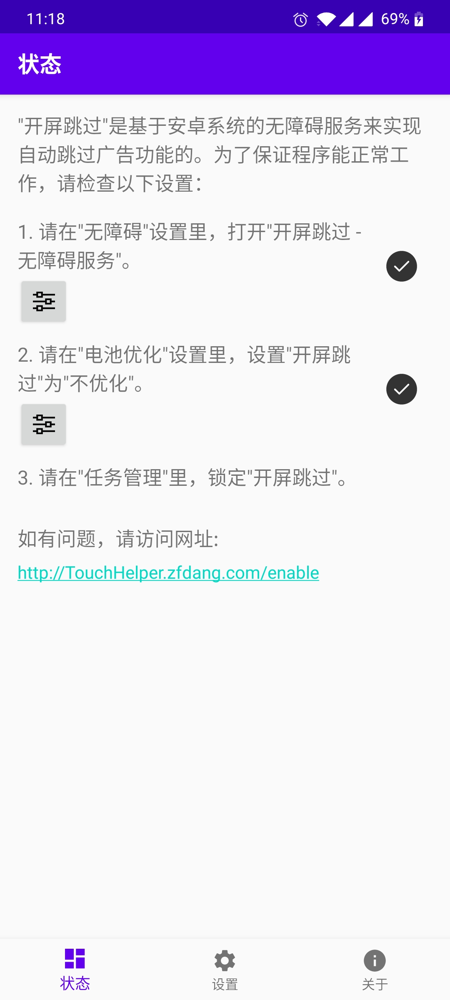
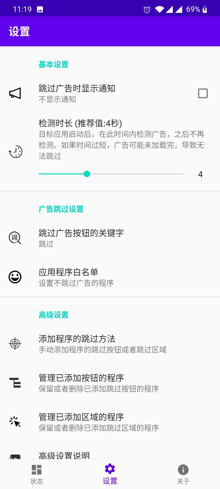
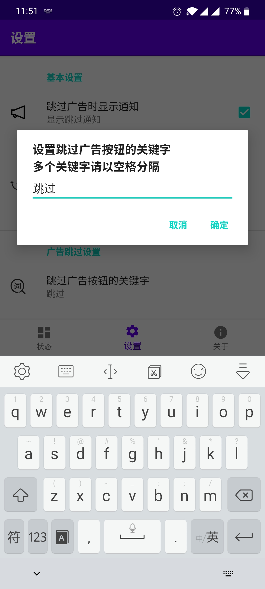
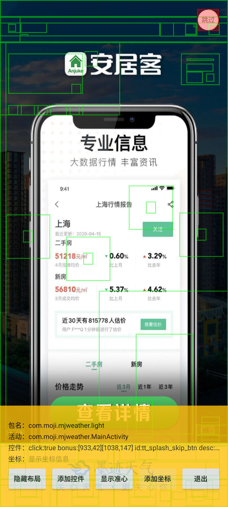
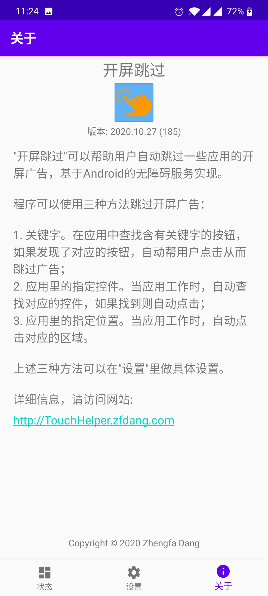
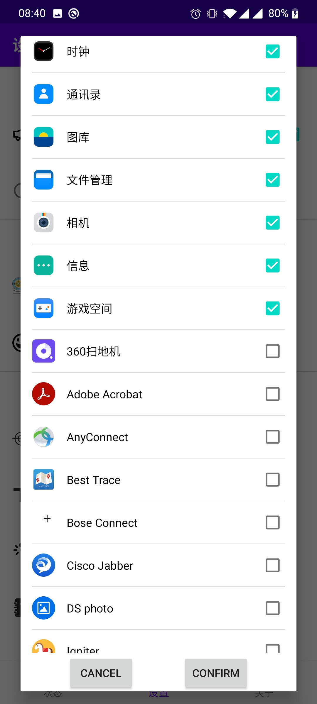

## 开屏跳过

安卓系统的开屏广告自动跳过助手

自动跳过软件的实现，一般都是基于安卓的Accessibility“无障碍服务”实现。开启了无障碍服务的软件，可以获取屏幕上的任何内容，从而可以检测广告，帮助用户自动跳过。因此，使用广告跳过程序，最大的风险是个人信息被泄露！

**本程序是开源程序，不需要网络权限，不需要存储权限，不会收集或者上传任何信息！绝无隐私问题！**

## 功能介绍

"**开屏跳过**"可以帮助用户自动跳过一些应用的开屏广告，基于Android的无障碍服务实现。

程序可以使用三种方法跳过开屏广告：

1. 关键字。在应用中查找含有关键字的按钮，如果发现了对应的按钮，自动帮用户点击从而跳过广告。
2. 应用里指定的控件。当应用工作时，自动查找对应的控件，如果找到则自动点击；
3. 应用里指定的位置。当应用工作时，自动点击对应的区域。

上述三种方法可以在"设置"里做进一步配置。

## 下载程序

发布顺序由快到慢：

1. Github自动编译结果: [自动编译结果](https://github.com/zfdang/Android-Touch-Helper/releases)
2. 从本网站下载：[v2022.02.17](TouchHelper-release-v2022.02.17.apk)
3. Google Play Store: [开屏跳过](https://play.google.com/store/apps/details?id=com.zfdang.touchhelper)

## 支持作者

## 程序演示和截图

[视频演示](touch_helper.mp4)

[Youtube](https://www.youtube.com/watch?v=_Ko-HM7sFps)

### 截图

## 常见问题

### 1. 程序无法正常工作？

因为程序需要始终在后台运行，所以需要适当的设置，才能让程序正常工作。

点击这里查看具体的解决方法：

[设置程序](/enable)

### 2. 在一些不含广告的应用里频繁提示跳过

那是因为程序在应用里发现了关键字。如果问题严重，请将应用添加到“白名单”里

### 3. 跳过广告的高级设置

除了关键字外，程序支持对一些特殊的应用，指定控件或者位置，然后程序会自动点击对应的控件或者位置，帮助用户实现某些目标。

点击这里查看具体的设置方法：

[广告跳过高级设置](/settings)

## 发现问题？

请在Github项目页创建Issue:

[Android Touch Helper](https://github.com/zfdang/Android-Touch-Helper)

