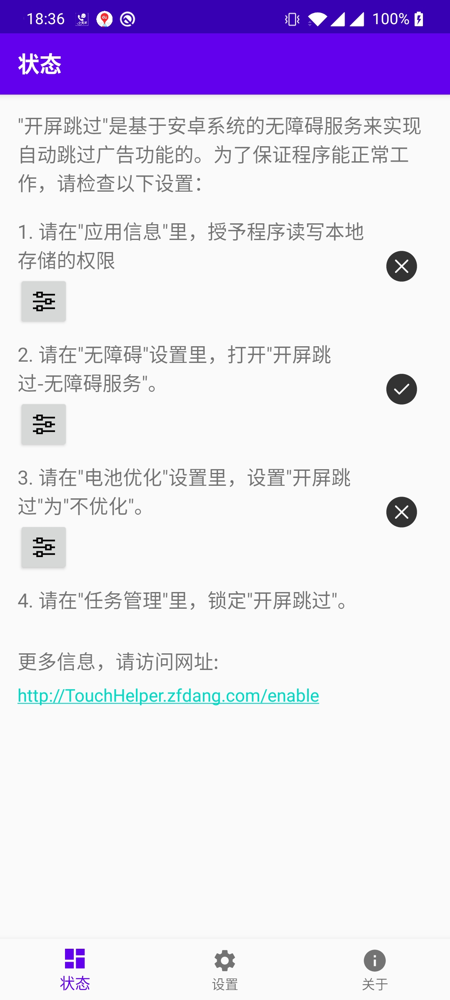
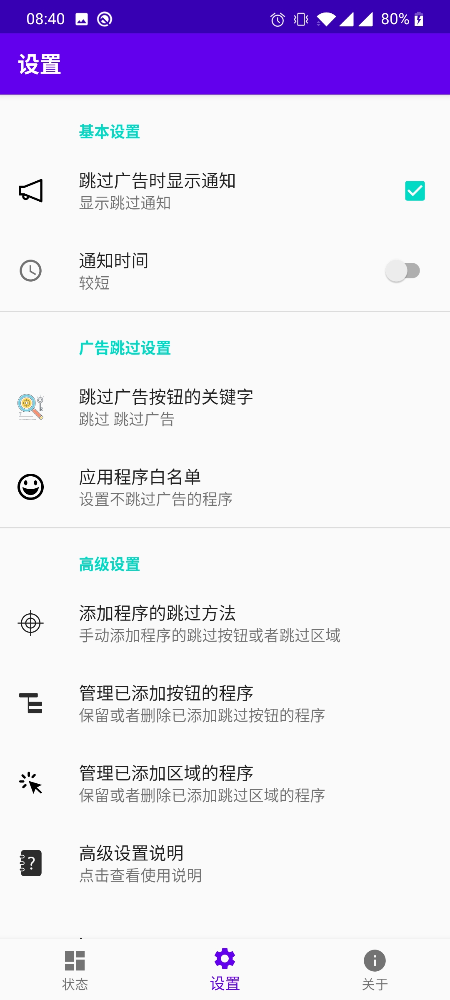
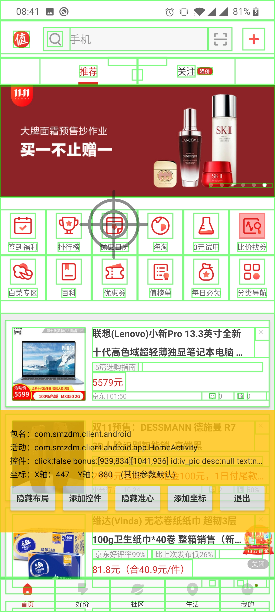
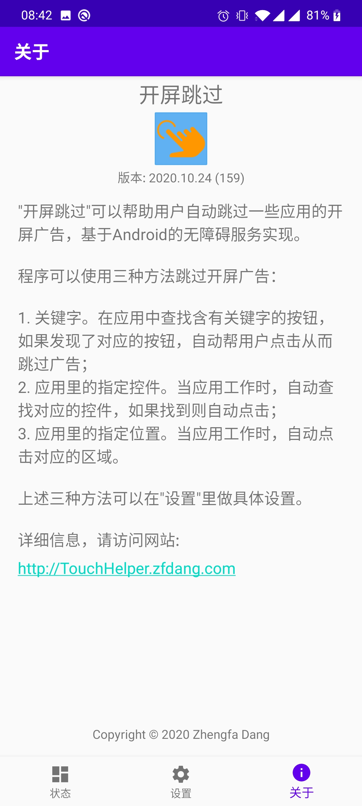

## 功能介绍

"**开屏跳过**"可以帮助用户自动跳过一些应用的开屏广告，基于Android的无障碍服务实现。

程序可以使用三种方法跳过开屏广告：

1. 关键字。在应用中查找含有关键字的按钮，如果发现了对应的按钮，自动帮用户点击从而跳过广告。
2. 应用里指定的控件。当应用工作时，自动查找对应的控件，如果找到则自动点击；
3. 应用里指定的位置。当应用工作时，自动点击对应的区域。

上述三种方法可以在"设置"里做具体设置。

**本程序是开源程序，不需要网络权限，不需要存储权限，不会收集或者上传任何个人信息！请放心使用！**

## 下载程序

1. Github自动编译结果: [自动编译结果](https://github.com/zfdang/Android-Touch-Helper/releases)

2. 当前发布的最新版本：[当前版本](TouchHelper-release-v2020.10.24.apk)

## 程序截图和演示

[视频演示](demo.mp4)

## 常见问题

### 1. 程序无法正常工作？

因为程序需要始终在后台运行，所以需要适当的设置，才能让程序正常工作。

点击这里查看具体的解决方法：

[设置程序](/enable)

### 2. 跳过广告的高级设置

除了关键字外，程序支持对一些特殊的应用，指定控件或者位置，然后程序会自动点击对应的控件或者位置，帮助用户实现某些目标。

点击这里查看具体的设置方法：

[广告跳过高级设置](/settings)

## Support or Contact

请在Github项目页创建Issue:

[Android Touch Helper](https://github.com/zfdang/Android-Touch-Helper)

## 感谢

项目借鉴了不少AccessibilityTool的代码，在此表示感谢！

https://github.com/LGH1996/AccessibilityTool

