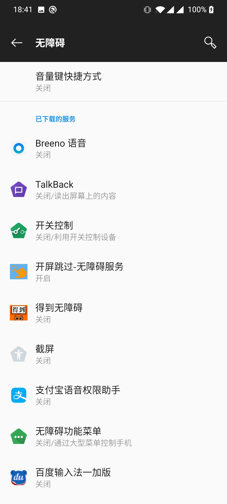
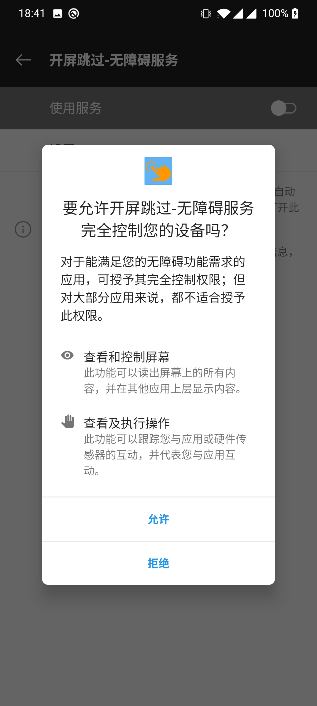
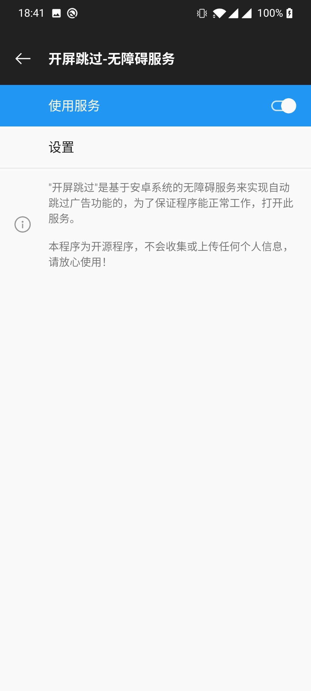
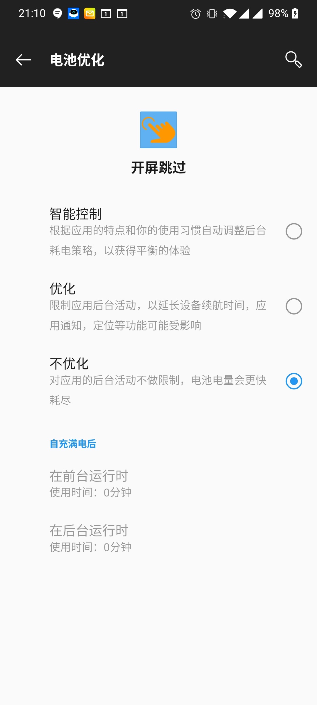
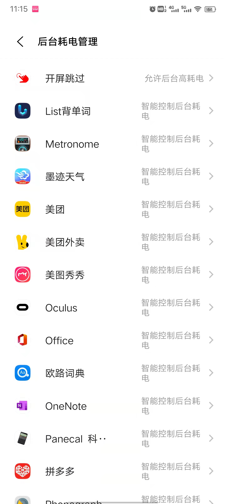

开屏跳过是基于安卓的无障碍服务实现的，是一种在后台随时运行的程序。但是因为安卓系统的多样性，某些情况下程序可能会被中止运行，导致无法跳过广告。

如果出现这种问题，请检查下面的几个可能原因：

## 1. 在无障碍设置里开启本服务

安卓系统的Accessibility服务，可能会被翻译成”无障碍"服务，或者“辅助功能”等。

需要在系统设置里，启用“开屏跳过"服务。

### 步骤1

### 步骤2

### 步骤3

## 2. 在电源优化里选择不优化本程序

安卓系统会对应用进行电源优化。请将本程序的电源优化设置成“不优化”。

此项设置为标准安卓系统都有的设置，但各个ROM并非完全遵守此设定。

## 3. 在特定ROM的电池管理里将本程序加入白名单

各品牌的手机往往会有自己的电池管理方法，需要将本程序添加到ROM自己的电池管理白名单里。

#### 3.1 VIVO系统的设置路径为：设置 -> 电池  -> 后台耗电管理

**设置“开屏跳过”为“允许后台高耗电”**

### 3.2 OPPO系统

### 3.3 小米系统

貌似不需要单独设置这个，系统会遵循第二项的设置

### 3.4 华为系统

### 3.5 三星系统

## 4. 在任务管理或者后台清理程序里豁免本程序

请在任务管理，或者后台清理程序里，将本程序锁定，避免被误杀。

