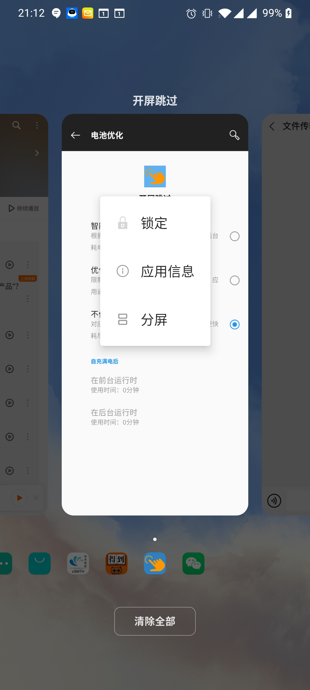

开屏跳过是基于安卓的无障碍服务实现的，是一种在后台随时运行的程序。但是因为安卓系统的多样性，某些情况下程序可能会被中指运行，导致无法跳过广告。

如果出现这种问题，请检查下面的几个可能原因：

# 1. 在无障碍设置里开启本服务

安卓系统的Accessibility功能，可能会被翻译成”无障碍"，或者“辅助功能”等。

需要在系统设置里，启用“开屏跳过"服务。

### 步骤1

### 步骤2

### 步骤3

# 2. 在电源优化里选择不优化本程序

Changing the battery optimization settings varies between each device, so we've written this guide that covers how to do this for most models: 

Disable Android's Battery Optimization for Accountable2You

# 3. 在任务管理或者后台清理程序里豁免本程序

If you've installed a third-party app to clean your phone or stop running background processes, you'll need to make an exclusion for Accountable2You. Contact the support team for that specific app to receive guidance on how to create an app exclusion. 

