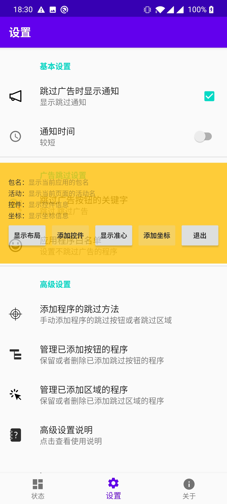
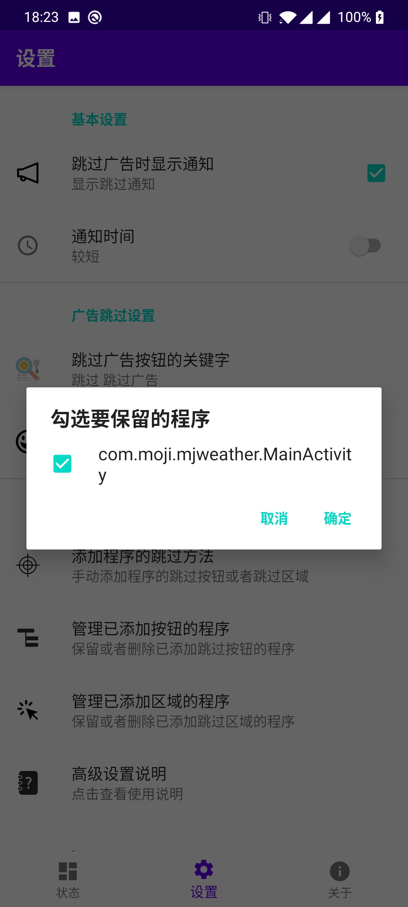

## 跳过广告的高级设置

“开屏跳过”可以使用三种方法跳过开屏广告：

1. 关键字。在应用中查找含有关键字的按钮，如果发现了对应的按钮，自动帮用户点击从而跳过广告。
2. 应用里指定的控件。当应用工作时，自动查找对应的控件，如果找到则自动点击；
3. 应用里指定的位置。当应用工作时，自动点击对应的区域。

如果你发现有些应用的广告无法跳过，你可以尝试使用下述的三种方法。

### 1. 定制关键字

缺省的关键字是：

1. 跳过

程序会查找所有含有这个关键字的控件，然后自动点击控件，帮用户跳过广告。如果目标应用使用的不是这些关键字，您可以在“设置”里增加新的关键字。

*如果控件的名字是"跳过 3"，或者“跳过广告 5"，程序也是可以找到控件并跳过广告的。*

### 2. 给目标应用增加指定的控件

我们可以在目标应用启动的时候，通过选择目标应用里的控件，然后添加到“开屏跳过”里，这样程序在下次启动应用的时候，就可以找到对应的控件，并点击跳过广告。

[演示视频](customize_activity.mp4)

步骤如下：

#### 2.1 在“设置”里，选择“添加程序的跳过方法”，将显示一个工具条，工具条可以上下拖动

#### 2.2 将目标程序彻底关闭，然后重新启动

#### 2.3 程序启动的过程中，选择工具条里的“显示布局”

#### 2.4 选择目标应用的某个控件，目标控件会被标红。如下图右上角的“跳过”按钮：

#### 2.5 点击工具条里的“添加控件”。如果“添加控件”不可用，那说明上一步没有选中控件。

#### 2.6 退出工具条，回到“设置”界面

#### 2.7 到“设置”里，点击“管理已添加按钮的程序”，确认程序已经被正确添加。

操作完成！当目标程序再次启动的时候，应该可以根据控件来跳过广告了。

### 3.  给目标应用增加指定的位置

与给目标应用添加控件的方法类似，请参照以上步骤。区别在于使用“显示准心”，“添加坐标”
